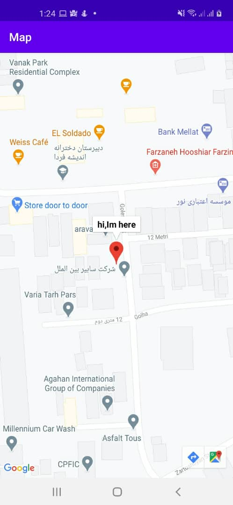

# Locating with RSSI (Received Signal Strength Indication)

The ultimate goal of positioning systems is to obtain the position of a person or object in a given coordinate system relative to a given point.

The positioning system in telecommunication networks generally consists of two main elements: the mobile terminal carried by the user and the base station or guide nodes that form the infrastructure of telecommunication networks. Existing positioning methods estimate the target position based on range measurement methods and signal input angle. 
As a result, the location or location process can be divided into two steps: in the first step, the entry angle is estimated using the guide signal. In the second step
User position is estimated based on geometric rules. The main geometric rules used to estimate location can be divided into three categories: circular lateration, hyperbolic mooring, and angulation.

This project contains Locating a specific cell on a mobile network. The UE collects from the target node and finally, the data is collected and sent to the central node to execute the algorithm.
The data obtained from the measurement of the received power.

## Language
The project is written in Java(Android).

## Images
</img> 

## Contributing
Pull requests are welcome. For major changes, please open an issue first to discuss what you would like to change.

Please make sure to update tests as appropriate.

## License
[ Apache-2.0 License](http://www.apache.org/licenses/)
